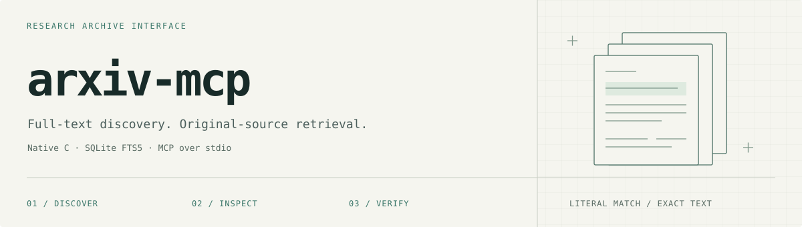

<picture>
  <source media="(prefers-color-scheme: dark)" srcset="docs/assets/banner-dark.svg">
  
</picture>

<p align="center">
  <a href="#quick-start">Quick start</a> ·
  <a href="#mcp-interface">MCP interface</a> ·
  <a href="docs/maintenance.md">Maintenance</a> ·
  <a href="#development">Development</a>
</p>

**A small, native interface to a full-text research corpus.** Search complete paper text, inspect promising results, and retrieve the original assembled LaTeX. The same C backend serves both people at a terminal and agents over MCP.

| Instrument | Specification |
| :--- | :--- |
| Retrieval | SQLite FTS5 · BM25 · literal-word AND matching |
| Discovery | Paper IDs and titles only; no body decompression |
| Inspection | Original text, metadata and Unicode-aware pagination |
| Transport | stdio, locally or over authenticated SSH |
| Serving runtime | C11 · cJSON · SQLite · zlib |
| Corpus | Pinned snapshots of [secemp9/arxiv-complete](https://huggingface.co/datasets/secemp9/arxiv-complete), `paper_text` subset |

## Quick start

Run on a machine with an imported library. The package does **not** include the corpus; see [initial setup](docs/maintenance.md#initial-setup) if you are starting from scratch.

```sh
nix build
export ARXIV_DATABASE=/srv/media/arxiv/library.sqlite3

./result/bin/arxiv search 'reactive reflection agents' --limit 5
./result/bin/arxiv show 2501.00430 --offset 0 --length 12000
./result/bin/arxiv status
```

Search first, then inspect. A result contains only what is needed to select a paper:

```json
{
  "mode": "bm25",
  "papers": [
    {
      "paper_id": "2501.00430",
      "title": "Enhancing LLM Reasoning with Multi-Path Collaborative Reactive and Reflection agents"
    }
  ]
}
```

Use `--category cs.AI` to filter the primary category. All commands return JSON. `show` returns up to 50,000 Unicode characters per page; follow `next_offset` until it is null for the complete text.

## MCP interface

```text
MCP client  ->  SSH / stdio  ->  arxiv-mcp  ->  arxiv  ->  SQLite
Terminal    ->  SSH          ---------------->  arxiv  ->  SQLite
```

No HTTP listener, database server, Python process or cross-machine database replica is required for serving.

| MCP tool | CLI command | Returns |
| :--- | :--- | :--- |
| `search` | `arxiv search` | Ranked paper IDs and titles |
| `paper` | `arxiv show` | Metadata and a page of original LaTeX |
| `library_status` | `arxiv status` | Indexed-document count, initial import checkpoints and source settings |

A typical client configuration, with an SSH alias for the database host:

```json
{
  "mcpServers": {
    "arxiv": {
      "command": "ssh",
      "args": ["-T", "-o", "BatchMode=yes", "research-host", "arxiv-mcp"]
    }
  }
}
```

Replace `research-host` with your SSH host or alias. The remote command must be available in non-interactive SSH sessions; use an absolute executable path or a wrapper if necessary. Configure `ARXIV_DATABASE` on that remote host, not just in the client's environment. Verify unfamiliar SSH host keys rather than disabling checking.

<details>
<summary>Runtime configuration</summary>

| Setting | Default | Purpose |
| :--- | :--- | :--- |
| `ARXIV_DATABASE` | `/srv/media/arxiv/library.sqlite3` | SQLite database opened read-only; the CLI also accepts `--database` |
| `ARXIV_BINARY` | `arxiv` | Backend executable; the Nix adapter supplies its absolute path |
| `ARXIV_TIMEOUT` | `60` seconds | MCP backend subprocess deadline |

SQL ranking has a separate 30-second progress-handler deadline. Storage stalls can delay cancellation. Broad cold searches can be I/O-bound; a small response is not a promise of low search latency.

The adapter uses fixed argument vectors, no shell, and JSON on the backend's standard input. Paper contents are untrusted research material, never instructions to execute.

</details>

## Operating the archive

**[Maintenance runbook →](docs/maintenance.md)** covers initial import, incremental refresh, verification, backups, SSD snapshots and recovery.

The boundary is deliberate: **C serves; Python maintains.** The separate Linux `maintenance` package handles Parquet ingestion, archive updates, audits and snapshot publication. It has no Python MCP server. Optional embedding-generation and index-maintenance tools are retained, but native search is BM25-only and embeddings are not required.

> This is a versioned research collection, not a live arXiv feed. It contains assembled LaTeX, not the complete PDF archive or every historical paper version. Check coverage before drawing conclusions from missing results. Dataset availability does not override individual paper licences.

## Development

```sh
nix develop
make clean all test
nix build .#maintenance
```

The native suites exercise the CLI and real MCP subprocess protocol without Python or PATH tools. The maintenance package runs its own tests for ingestion, refresh, audits, publication and retained embedding tooling. Test fixtures are synthetic; production corpus verification is a separate operator task.

---

Transport and subprocess foundations are adapted from [willfish/himalaya-mcp](https://github.com/willfish/himalaya-mcp/tree/0979a1c8cf9ad4c03cbdf84f2a8895580756e5fd). This is independent tooling, not an official arXiv service.
